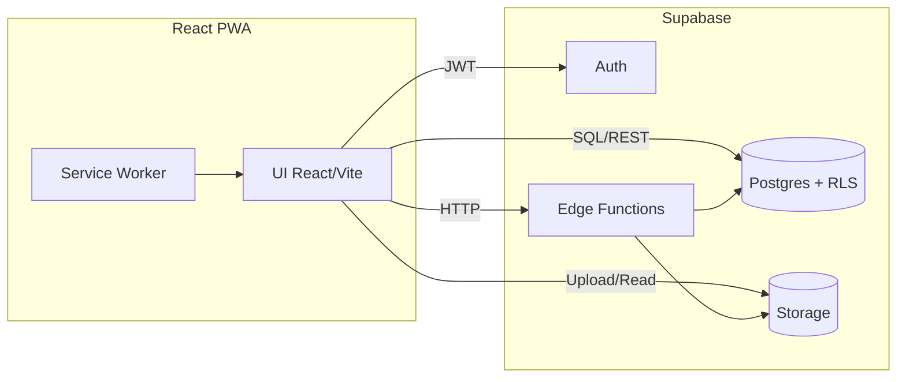

# Arquitectura — SaaS de Inventarios Multi‑tenant (MVP)

Versión documento: 0.1  
Fuente primaria: docs/PRD.md, sprints/backlog-initial.md  
Workspace/commit: no-vcs-local

## 1. Visión general
Plataforma B2B multi‑tenant para gestión de inventarios, pedidos B2B y catálogo público opt‑in. Seguridad por RLS (Postgres/Supabase), almacenamiento de medios en Supabase Storage y PWA como canal principal. Edge Functions para lógica sensible (PEPS, auditoría, export/erase) y endpoints públicos cacheables para catálogo.

## 2. Nicho y cumplimiento
Dominio: operaciones e-commerce/B2B y supply chain liviana. Cumplimiento: Habeas Data (Colombia) y alineado a GDPR cuando aplique. Export/erase por tenant y controles de acceso a PII/medios.

## 3. Arquitectura lógica (alto nivel)
- Frontend: React + Vite (PWA), TypeScript, i18n es/en, TanStack Query, react-hook-form + Zod, Router.  
- Backend gestionado: Supabase (Auth, Postgres, Storage).  
- Edge Functions (Deno) para: 
  - Creación de tenant + bootstrap de Owner. 
  - Invitaciones de usuarios (email) y roles. 
  - Movimientos con costeo PEPS y auditoría. 
  - Exportación/erase por tenant. 
  - Endpoints del catálogo público (SEO y cache CDN). 
- RLS en tablas críticas: acceso por memberships (user↔tenant) y rol.

### Diagrama de componentes (Mermaid)


### Diagrama de despliegue (Mermaid)
```mermaid
deploymentDiagram
  node Browser {
    component "PWA (React)" as PWA
  }
  node "CDN/Static Hosting" as CDN {
    artifact bundle
  }
  node "Supabase Cloud" as SUP {
    component Auth
    component Postgres
    component Storage
    component "Edge Functions" as Edge
  }
  PWA -down-> CDN
  PWA -right-> Auth
  PWA -right-> Postgres
  PWA -right-> Storage
  PWA -right-> Edge
  Edge -down-> Postgres
  Edge -down-> Storage
```

## 4. Seguridad y multi‑tenant
- Autenticación: Supabase Auth (email y OAuth Google).  
- Tenancy: todas las tablas críticas incluyen tenant_id.  
- RLS: políticas permiten leer/escribir solo filas con tenant_id ∈ memberships del usuario; Super‑admin global con bypass auditado.  
- Roles de aplicación (MVP): Owner, Admin, Inventario, Ventas/Caja, Auditor (read‑only).  
- Storage: bucket por tenant (tenant_<id>_media) con subcarpetas signatures/, images/, videos/, docs/; políticas de acceso por rol.

## 5. Modelo de datos (resumen)
- Core: tenants, users, memberships(rol).  
- Inventario: products, product_variants, categories, price_lists/items, warehouses, batches (lotes/series, caducidad), stock_items(variant/warehouse/lote), inventory_movements.  
- Pedidos: purchase_orders/items, sales_orders/items, customers, suppliers.  
- Público: public_catalog_settings, public_catalog_products.  
- Auditoría/otros: audit_log, signatures, documents, plans, tenant_plan_modules, webhooks/connectors.

## 6. Contratos API (MVP)
Convención: Edge Functions HTTP JSON con autorización Bearer (JWT Supabase) salvo endpoints públicos del catálogo. Validación con Zod y códigos HTTP estándar.

1) Crear tenant (bootstrap Owner)
- POST /api/tenants.create  
- Request
```json
{
  "name": "Acme S.A.",
  "slug": "acme",
  "owner": { "email": "owner@acme.com", "full_name": "Jane Doe" }
}
```
- Reglas: name 2..100, slug kebab-case único, email válido.  
- Response 201
```json
{ "tenant_id": "uuid", "slug": "acme" }
```

2) Invitación de usuario (rol)
- POST /api/invitations.send  
- Request
```json
{ "tenant_id": "uuid", "email": "user@acme.com", "role": "Admin" }
```
- Reglas: role ∈ {Owner,Admin,Inventario,Ventas,Auditor} (Owner solo por Owner).  
- Response 202
```json
{ "status": "queued" }
```

3) Productos (CRUD mínimo)
- POST /api/products.create  
- Request
```json
{ "tenant_id": "uuid", "name": "Camiseta", "sku": "TS-001", "category_id": "uuid", "tax_rate": 0.19 }
```
- Response 201 { "product_id": "uuid" }

4) Movimiento de inventario (PEPS)
- POST /api/inventory.move  
- Request
```json
{ "tenant_id":"uuid", "type":"SALIDA", "warehouse_id":"uuid", "items":[{"variant_id":"uuid","qty":5}], "ref":"SO-1001" }
```
- Reglas: type ∈ {ENTRADA,SALIDA,TRASPASO}; PEPS calcula costo y sugiere lotes.  
- Response 201 { "movement_id": "uuid", "cost_total": 123.45 }

5) Pedido de venta (ciclo)
- POST /api/sales_orders.create  
- PATCH /api/sales_orders/:id/confirm  
- PATCH /api/sales_orders/:id/ship  
- Reglas: confirmar genera SALIDA; ship cambia estado a ENVIADO.

6) Catálogo público
- GET /public/catalog/:tenantSlug/products?price_list=default  
- Response 200: lista de productos/variantes; precios visibles según setting. Cache CDN (60–300s).

7) Auditoría y export/erase
- GET /api/audit?user=:id&table=:t&from=:date&to=:date  
- POST /api/export.tenant  
- POST /api/erase.request (workflow con confirmación Owner).

Nota: Endpoints CRUD restantes siguen el mismo patrón (create/get/update/delete) con validación consistente.

## 7. Observabilidad y calidad
- Logs: Edge Functions + Supabase logs; audit_log por mutaciones críticas.  
- Métricas: uso por tenant (nº SKUs, movimientos/día), tiempos de respuesta.  
- Testing: suites de PEPS (casos ENTRADA/SALIDA/TRASPASO), RLS (acceso cruzado), estados de pedidos.

## 8. Rendimiento y escalabilidad
- Índices: inventory_movements(movement_date, warehouse_id, product_id).  
- Particionado temporal si >50k movimientos/día.  
- Caching: CDN para endpoints públicos; SW para assets PWA.  
- Storage: límites por plan (definir) y políticas de lifecycle si aplica.

## 9. Riesgos y mitigaciones (MVP)
- Complejidad de PEPS/FEFO → pruebas exhaustivas y invariantes de costo.  
- Cumplimiento (GDPR/Habeas Data) → procesos export/erase auditados.  
- Escala de movimientos → índices y potencial particionado.  
- PWA sin offline avanzado → alcance limitado y mensajes claros en UI.  
- Costos de Storage → cuotas por plan y compresión.

## 10. Roadmap técnico (MVP)
- S1–2: base multi‑tenant (auth, tenants, memberships, RLS).  
- S3–4: productos/variantes/categorías/medios.  
- S5–6: bodegas/stock/movimientos/PEPS.  
- S7–8: compras y ventas.  
- S9: catálogo público.  
- S10: auditoría/reportes.  
- S11–12: hardening, export/erase, QA/perf.

## 11. Tallas (T‑shirt) por historia (MVP)
1) Tenant + invitaciones: M  
2) Productos/variantes: L  
3) Bodegas/stock: M  
4) Movimientos + PEPS: XL  
5) Pedidos compra: M  
6) Pedidos venta: L  
7) Catálogo público: M  
8) Audit log: M  
9) Export/erase PII: M  
10) Impuestos/moneda: S  
11) Planes/módulos: M  
12) i18n es/en: S

## 12. Dependencias externas
- Supabase (Auth, Postgres, Storage, Edge Functions).  
- CDN estático para frontend y catálogo.

## 13. Preguntas abiertas
- ¿Hay limitaciones de hosting o costes que debamos cumplir?  
- ¿Requisitos de latencia o disponibilidad SLO/SLA?  
- ¿Confirman Supabase como DB/Auth/Storage para MVP?  
- Tailwind: ¿prefieren v4 (CSS‑first) o v3 estable? ¿Integración con design tokens?  
- ¿Límites por plan para número/tamaño de medios por tenant?  
- ¿Lista de precios pública: una por empresa o múltiples segmentadas?  
- ¿FEFO obligatorio por categoría o por producto?  
- ¿Retención fiscal por país parametrizable a nivel tenant?